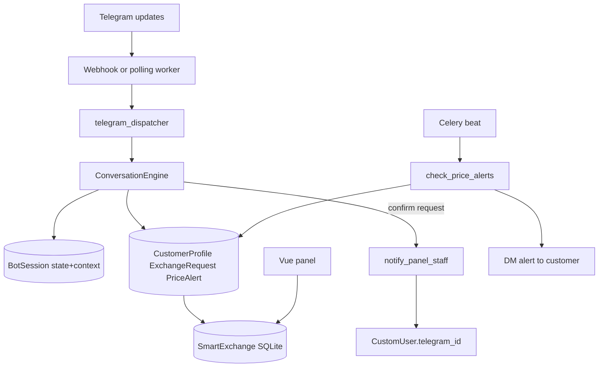

# Telegram customer bot — Plan V1

Conversational Telegram customer bot inside SmartExchange that shares the panel SQLite DB with the webapp. Outbound price publishing stays as-is; this plan adds inbound conversation on top.

**Status:** V1 complete (Phases 1–7)  
**Doc:** `SmartExchange/docs/telegramCustomerPlanV1.md`

### Ops notes (panel staff)

- Staff who should get Confirm DMs need a non-empty `telegram_id` on their `CustomUser` (roles `super_admin` or `management`).
- Customer tags (`global` / `vip` / `special`) are set in Telegram Hub → **Customers**.
- Inbound: webhook `POST /api/telegram/webhook/<bot_id>/`, or `python manage.py poll_telegram_bots`. Set `SiteSettings.telegram_webhook_base_url` (https) then `poll_telegram_bots --register-webhooks`.
- Price alerts: Celery worker + beat (`telegram_app.check_price_alerts`, default every 120s).

---

## Locked decisions (all phases)

- Live in SmartExchange (`telegram_app` + new models), same DB as the web panel (`backend/data/db.sqlite3`). Do **not** wire Iraniu’s separate DB.
- Keep existing outbound price publishing unchanged.
- Admin notify recipients: active `CustomUser` with role `super_admin` or `management` and non-empty `telegram_id` ([`accounts/models.py`](../backend/accounts/models.py)).
- Customer **tag**: `global` | `vip` | `special`, default `global`, set only by panel staff; shown in profile as text (not a button).
- Request field **Price by the time of change**: typed by the customer (not auto-filled from board prices).
- Bot pickers use worldwide `allCurrencies.txt`; panel `category.Currency` stays for board publishing.

## Architecture (target end state)

Reuse Iraniu’s layering (thin ingress → dispatcher → engine returns `{text, reply_markup}` → dispatcher sends). Reference only: [`Request-Manage-System/core/services/conversation.py`](../backend/Request-Manage-System/core/services/conversation.py). Do not import Iraniu models or use its DB.

## Main menu (buttons)

After `/start` and after completed flows:

1. **Customer profile**
2. **Registering for exchange**
3. **Notification System**

## Out of scope (entire V1)

- Changing Iraniu / Request-Manage-System
- Auto-filling request price from board
- Customer self-service tag change
- Full CRM beyond pending + staff Telegram ping

---

## Phase overview

| Phase | Goal | Depends on |
|-------|------|------------|
| **1** | Data foundation: models, migrations, currency catalog | — |
| **2** | Inbound Telegram: webhook/polling, dispatcher, FSM shell + main menu | Phase 1 |
| **3** | Customer profile + exchange request flow + staff notify | Phase 2 |
| **4** | Notification System (increase/decrease alerts) + confirm/edit | Phase 2 |
| **5** | Celery beat price-alert checker | Phase 1 + 4 |
| **6** | Staff panel: customer tag API + minimal Vue | Phase 1 |
| **7** | Tests covering FSM, notify, alert math | Phases 2–6 |

Phases 3 and 4 can run in parallel after Phase 2. Phase 6 can start after Phase 1. Phase 5 needs Phase 4 models in use. Phase 7 lands last or incrementally per phase.

---

## Phase 1 — Data foundation

**Goal:** Persist customers, sessions, requests, and alerts in the shared SmartExchange DB; ship a worldwide currency list with a load/paginate helper. No Telegram ingress yet.

### Deliverables

1. Models in [`telegram_app/models.py`](../backend/telegram_app/models.py) (preferred; split to a new app only if the file becomes unwieldy):

   **`CustomerProfile`**
   - `telegram_user_id` (unique), username/names, language
   - `tag`: `global` | `vip` | `special` (default `global`)
   - timestamps

   **`BotSession`**
   - unique `(telegram_user_id, bot)` FK to existing `TelegramBot`
   - `state` CharField/enum (include at least `START`, `MAIN_MENU`; more states added in later phases)
   - `context` JSONField (default `{}`)
   - `last_activity`

   **`ExchangeRequest`**
   - FK `customer` → `CustomerProfile`, optional FK `bot` → `TelegramBot`
   - `source_currency`, `target_currency` (ISO codes as strings)
   - `amount` (Decimal), `price_at_request` (Decimal; customer-typed), `ttl_minutes` (PositiveInteger)
   - `status`: `pending` | `notified` | `closed`
   - timestamps

   **`PriceAlert`**
   - FK `customer`
   - `direction`: `increase` | `decrease`
   - `source_currency`, `target_currency`, `target_price`
   - `is_active`, `last_triggered_at` (nullable)
   - timestamps

2. Django migrations applied cleanly against the SmartExchange DB.

3. File [`telegram_app/data/allCurrencies.txt`](../backend/telegram_app/data/allCurrencies.txt): ISO 4217 codes + English names, one per line: `USD|US Dollar`.

4. Helper [`telegram_app/services/currency_catalog.py`](../backend/telegram_app/services/currency_catalog.py):
   - load/parse the file (cache in memory)
   - lookup by code
   - paginate for Telegram inline keyboards (~8–10 items per page + Next/Prev callback tokens)

5. Register models in Django admin (basic list/filter) so staff can inspect rows during later phases.

### Done when

- `migrate` succeeds
- Catalog loads and paginates in a unit test
- Models importable; no webhook/conversation code required in this phase

### Explicitly not in Phase 1

- Webhook, polling, ConversationEngine
- Vue UI, Celery beat
- Creating requests/alerts from Telegram

---

## Phase 2 — Inbound Telegram + FSM shell

**Goal:** Receive Telegram updates and show the main menu. Existing `send_message` / `send_photo` publishing must keep working.

### Deliverables

- Extend [`TelegramService`](../backend/telegram_app/services/telegram_client.py) or add helpers for edit message / answer callback if needed
- Webhook: `POST /api/telegram/webhook/<bot_id>/`
- Dev polling management command (or worker) when HTTPS webhook is unavailable
- Optional `setWebhook` when public base URL exists on `SiteSettings`
- [`telegram_app/services/dispatcher.py`](../backend/telegram_app/services/dispatcher.py): parse update, dedupe/lock, upsert `CustomerProfile`, get/create `BotSession`, call engine, send/edit reply
- [`telegram_app/services/conversation.py`](../backend/telegram_app/services/conversation.py): `/start` → main menu with three buttons; stub handlers that reply “coming soon” or no-op for the three menu entries until Phases 3–4
- Only slash command: `/start`

### Done when

- Sending `/start` to a configured bot returns the three main-menu buttons
- Price finalize → Telegram photo publish still works

---

## Phase 3 — Profile + exchange requests + staff notify

**Goal:** Full customer profile and exchange registration flows; Confirm notifies panel staff.

### Deliverables

**Customer profile**
- Show **Current Tag** as text (not a button)
- Buttons: History Of Requests, Most Requested Currencies, ID
- History from `ExchangeRequest`; most-requested aggregates; ID shows `telegram_user_id`

**Registering for exchange** (draft in `session.context`)
1. Source currency (paginated catalog)
2. Target currency
3. Amount
4. Price by the time of change (typed)
5. TTL → parse to `ttl_minutes` (`30`, `30m`, `1h`, etc.)
6. Summary + **Confirm** | **Edit**
   - Confirm → create `ExchangeRequest`, success reply, notify staff, main menu
   - Edit → field buttons → re-ask one field → summary again

**Staff notify** — [`telegram_app/services/admin_notify.py`](../backend/telegram_app/services/admin_notify.py):
- Fan-out to active `CustomUser` with role `super_admin` or `management` and non-empty `telegram_id`
- Failures logged; do not crash the customer flow
- Mark request `notified` when at least one send succeeds (or always after attempt—document choice in code)

### Done when

- End-to-end request create + staff DM in a manual test
- Profile history reflects submitted requests

---

## Phase 4 — Notification System (alerts UI in bot)

**Goal:** Price increase / decrease alert registration with the same confirm/edit pattern.

### Deliverables

- Submenu under Notification System: Price increase Alert | Price Decrease Alert
- Increase intro: *If the price Grow upper than the target the bot will Alarm you*
- Decrease: mirrored wording
- Flow: intro → source → target → target price → summary Confirm/Edit → on Confirm save `PriceAlert`, reply **Confirmed**, main menu
- Reuse currency pagination and edit-field pattern from Phase 3

### Done when

- Customer can create active increase and decrease alerts via Telegram
- No automatic price checking yet (Phase 5)

---

## Phase 5 — Celery price-alert checker

**Goal:** Periodically compare board prices to alerts and DM customers.

### Deliverables

- Task in `telegram_app` (e.g. `alert_checker.py` + Celery task)
- Register in `CELERY_BEAT_SCHEDULE` (~1–5 min)
- Resolve current price via latest `PriceHistory` for a matching `PriceType` (source/target currencies); if no board pair, skip and log (do not invent FX)
- Increase: fire when current ≥ target; Decrease: when current ≤ target
- DM customer; set `last_triggered_at`; default **1h cooldown**, keep alert active

### Done when

- With a matching board price and alert, beat run sends a DM once and respects cooldown

---

## Phase 6 — Staff panel (customer tag)

**Goal:** Admins set Global / VIP / Special on customers from the webapp (same DB).

### Deliverables

- DRF: list/detail customers; PATCH `tag` for `management` / `super_admin`
- Optional: list exchange requests and price alerts (read-only)
- Vue: Telegram Customers section with tag dropdown
- Reminder in UI/docs: staff need `telegram_id` on their user for Confirm notifications

### Done when

- Admin can change a customer tag in the panel; bot profile shows the new tag on next open

---

## Phase 7 — Tests

**Goal:** Regression coverage for the critical paths.

### Deliverables

- Currency catalog pagination tests (can land with Phase 1)
- FSM transitions: `/start`, request confirm/edit, alert confirm/edit
- `admin_notify` recipient filter (roles + empty `telegram_id` excluded)
- Alert trigger math and cooldown

### Done when

- CI / `manage.py test` covers the above without live Telegram

---

## File map (cumulative)

| Path | Phases |
|------|--------|
| `telegram_app/models.py` | 1 |
| `telegram_app/data/allCurrencies.txt` | 1 |
| `telegram_app/services/currency_catalog.py` | 1 |
| `telegram_app/services/conversation.py` | 2–4 |
| `telegram_app/services/dispatcher.py` | 2 |
| `telegram_app/services/admin_notify.py` | 3 |
| `telegram_app/services/alert_checker.py` | 5 |
| webhook URLs + polling command | 2 |
| staff API + Vue customers | 6 |
| tests | 1, 7 |

## Reference: Iraniu patterns to copy (not share DB)

- Conversation state machine + `callback_data` buttons
- Dispatcher lock/dedupe + edit-on-callback
- Post-create admin fan-out (adapt to `CustomUser.telegram_id`)
